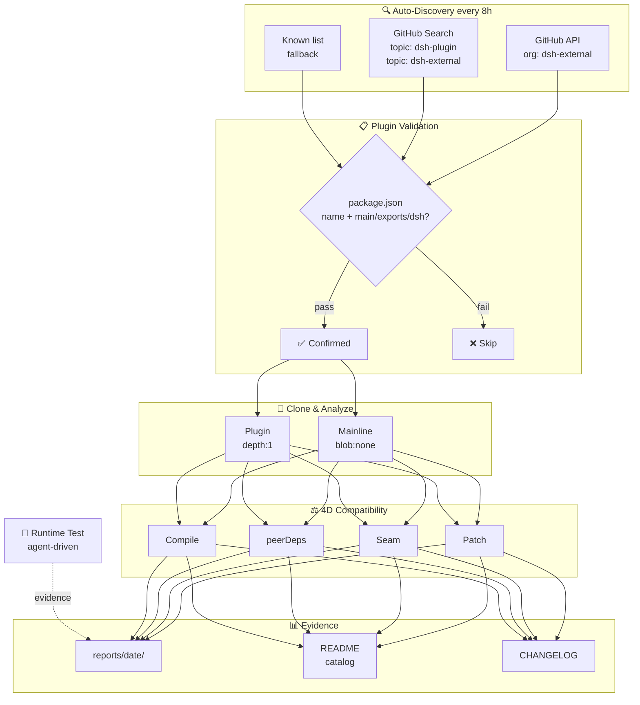

# Awesome DSH Plugins

**A daily-updated radar that auto-discovers and compatibility-tests every plugin for DeepSeek Harness.**
Know which plugins work before you install them.

   

[English](README.en-US.md) | [简体中文](README.md)

---

**What is this?** DeepSeek Harness (DSH) is an open-source coding agent where everything is a plugin. This repo is a **radar** that automatically tracks its plugin ecosystem — **124 plugin repos indexed** (clone-verified package.json), **5 with runtime test records**.

## How it works

## Quick Start

| Goal | Link |
|---|---|
| Browse Star Top 20 | [🔥 Star Top 20](#-star-top-20) |
| Find a plugin by use case | [📋 Plugin Catalog](#plugin-catalog) · [PLUGINS.md](PLUGINS.md) — 9 categories, compat status per plugin |
| Browse all auto-discovered repos | [📊 Ecosystem Snapshot](#ecosystem-snapshot) — dated compatibility matrix |
| See what changed recently | [📝 CHANGELOG](CHANGELOG.md) |
| Register or submit a plugin | [🔧 For Plugin Developers](#for-plugin-developers) · add the `dsh-plugin` topic → discovered within 8h · [PR template](.github/PULL_REQUEST_TEMPLATE.md) |
| Maintain this radar | [⚙️ Automation SOP](docs/SOP.md) |
| Plugin user guide | [📖 For Plugin Users](#for-plugin-users) |
| How we assess compatibility | [🔍 How We Assess Compatibility](#how-we-assess-compatibility) |
| Join the community | [💬 dshfind.com](#-dsh-learning-community-dshfindcom) · [WeChat group](#wechat-group) |

> [!IMPORTANT]
> **Inclusion ≠ compatible, static check ≠ runtime-usable, runtime-usable ≠ security-audited.**
> This repo provides traceable filtering signals, not official DSH endorsement. Always review plugin source, permissions, dependencies, and license before installing.

## 🔥 Star Top 20

<!-- AUTO:featured:START -->

> 按 GitHub star 数排序，每 20 分钟自动刷新。数据截至 2026-08-17 17:03。

| # | 插件 | ⭐ | 说明 |
|---|---|---|---|
| 1 | [dsh-web-ui](https://github.com/zhu1090093659/dsh-web-ui) | 4066 | Plugin and skin collection for DeepSeek Harness (DSH) W… |
| 2 | [DSH-better-sidebar](https://github.com/omdsh-dev/DSH-better-sidebar) | 1929 | 开放的侧边栏底座，支持三方拓展注册新侧边栏页面。内置文件渲染编辑/终端/Git/子代理页面 |
| 3 | [dsh-TUI](https://github.com/ccch1mneyyy/dsh-TUI) | 1800 | DSH 官方公众号收录的 TUI 补位插件：Claude Code 风，鲸鱼顶栏/实时状态/流式思考/双击 E… |
| 4 | [sandbase-harness](https://github.com/sandbaseai/sandbase-harness) | 613 | Open-source CMA-compatible agent runtime for any model,… |
| 5 | [dsh-ads](https://github.com/Nagi-ovo/dsh-ads) | 480 | 把 DSH 变成 2005 年门户网站｜Parody ads, fake games, and popups … |
| 6 | [deepseek-harness-desktop-app](https://github.com/vibeinging/deepseek-harness-desktop-app) | 310 | DeepSeek Harness Desktop App: a local AI desktop worksp… |
| 7 | [dsh-browser](https://github.com/Lum1104/dsh-browser) | 246 | dsh plugin: Chrome sidebar extension that lets DeepSeek… |
| 8 | [oh-dsh](https://github.com/hust-open-atom-club/oh-dsh) | 238 | 一套 DSH runtime，Desktop、Web 与 TUI 三种开发体验。 |
| 9 | [whale-girl](https://github.com/vlln/whale-girl) | 221 | DSH Web GUI 桌面宠物插件（QQ 宠物形态）：右下角悬浮、可拖拽/投喂/玩耍的积累型伙伴。 |
| 10 | [dsh-tianshu-tui](https://github.com/huiliyi37/dsh-tianshu-tui) | 201 | 官方 DeepSeek Harness 的交互式终端 UI 插件：自研 ANSI 极简渲染核心（由作者自己的开… |
| 11 | [dsh-genui](https://github.com/omdsh-dev/dsh-genui) | 181 | GenUI for DeepSeek Harness: interactive UI components r… |
| 12 | [dsh-memory-evolve](https://github.com/csyangwen/dsh-memory-evolve) | 152 | 为 DeepSeek Harness 带来「跨会话长期记忆 + 后台自我进化」能力的纯插件实现：五轨记忆 · … |
| 13 | [dsh-openpencil](https://github.com/ZSeven-W/dsh-openpencil) | 106 | The DeepSeek Harness plugin for OpenPencil — preview, i… |
| 14 | [dsh_workflow](https://github.com/omdsh-dev/dsh_workflow) | 73 | 把Claude Code的UltraCode模式带给DSH，把 DSH 的一次性多 Agent 调度，升级为可… |
| 15 | [dsh-mnemon](https://github.com/omdsh-dev/dsh-mnemon) | 72 | Three-tier memory control plane for DeepSeek Harness: p… |
| 16 | [dsh-annotation](https://github.com/omdsh-dev/dsh-annotation) | 69 | DSH Web 选中批注插件：选文字→批注→回车随消息发送；气泡隐藏批注块（零闪烁）；回复按 Annotati… |
| 17 | [dsh-memento](https://github.com/PerryLink/dsh-memento) | 57 | Bounded, layered, approval-gated, auditable cross-sessi… |
| 18 | [plugin-registry](https://github.com/vlln/plugin-registry) | 53 | DSH 插件生态基建：薄控制台（浏览器面板管理官方 repository 插件，0 patch）+ make-… |
| 19 | [dsh-multica-runtime](https://github.com/multica-ai/dsh-multica-runtime) | 46 | Support dsh runtime on Multica. |
| 20 | [dsh-data-agent](https://github.com/omdsh-dev/dsh-data-agent) | 40 | Connect DSH to your database for conversational data an… |

<!-- AUTO:featured:END -->

## Plugin Catalog

<!-- AUTO:catalog:START -->

> 按功能领域分类（重分类修正）。点击标题展开，全部条目一次显示。

<h3>🔌 Web UI 增强（18）</h3>

*界面与交互增强插件：侧边栏、输入框、皮肤主题、面板 dock、消息显示、状态栏与可视化，让 Web 界面更顺手更好看*

| 插件 | 类型 | 兼容性 | 说明 |
|---|---|---|---|
| [dsh-vision](https://github.com/dsh-external/dsh-vision) | 插件 | 关注 | dsh 插件：给纯文本 DeepSeek 加视觉——view_image 工具桥接任意 OpenAI 兼容 VLM（默认智谱免费档，实测 4 厂商 10 模型） |
| [dsh-web-ui](https://github.com/dsh-external/dsh-web-ui) | 合集 | 关注 | Plugin and skin collection for DeepSeek Harness (DSH) Web UI - task board, git g |
| [ex-setting](https://github.com/dsh-external/ex-setting) | 插件 | 关注 | DSH的设置扩展 |
| [web-components](https://github.com/dsh-external/web-components) | 基建 | 关注 | web-components支持 |
| [dsh-split-panes](https://github.com/dsh-external/dsh-split-panes) | 插件 | 需适配 | — |
| [turtle-ui](https://github.com/dsh-external/turtle-ui) | 插件 | 需适配 | as is, no warranty |
| [dsh-ads](https://github.com/dsh-external/dsh-ads) | 插件 | 待调研 | 是兄弟就来蹬我！DSH Web UI 广告：2005 年中文站点风格的侧栏广告 / 对话内信息流 / 角落弹窗 + 一个真实热区比视觉小得多的关闭叉 |
| [dsh-aigc-canvas](https://github.com/dsh-external/dsh-aigc-canvas) | 插件 | 待调研 | — |
| [dsh-annotation](https://github.com/dsh-external/dsh-annotation) | 插件 | 待调研 | DSH Web 选中批注插件：选文字→批注→回车随消息发送；气泡隐藏批注块（零闪烁）；回复按 Annotation N 逐条对照（可悬浮芯片） |
| [dsh-anti-ads](https://github.com/dsh-external/dsh-anti-ads) | 插件 | 待调研 | — |
| [DSH-better-sidebar](https://github.com/dsh-external/DSH-better-sidebar) | 插件 | 待调研 | 一个侧边栏的完整工作台，支持三方拓展注册新Tab页面，内置文件渲染编辑/终端/Git/子代理 |
| [dsh-custom-css](https://github.com/dsh-external/dsh-custom-css) | 插件 | 待调研 | — |
| [dsh-drag-and-drop](https://github.com/dsh-external/dsh-drag-and-drop) | 插件 | 待调研 | 为 DSH Web UI 增加跨平台文件拖拽与原始路径插入能力，无需复制文件 |
| [dsh-message-edit](https://github.com/dsh-external/dsh-message-edit) | 插件 | 待调研 | DSH plugin: branch-based message editing, reroll, retry, version timeline |
| [dsh-side-panel](https://github.com/dsh-external/dsh-side-panel) | 插件 | 待调研 | DSH 侧边栏，集成文件浏览器、终端和 Git 审查，方便预览文件 |
| [dsh-ultra-ui](https://github.com/dsh-external/dsh-ultra-ui) | 插件 | 待调研 | — |
| [ui-status-label](https://github.com/dsh-external/ui-status-label) | 插件 | 待调研 | 把你鲸鱼娘思考时的 deep diving 自定义成任意你想要的样子 |
| [ya-workspace-sidebar](https://github.com/dsh-external/ya-workspace-sidebar) | 插件 | 待调研 | — |

*界面与交互增强插件：侧边栏、输入框、皮肤主题、面板 dock、消息显示、状态栏与可视化，让 Web 界面更顺手更好看*

<h3>🤖 Agent 能力（26）</h3>

*增强 agent 本身的能力：子代理管理、记忆与上下文、会话控制、规划执行、唤醒/睡眠、提示词与技能注入*

| 插件 | 类型 | 兼容性 | 说明 |
|---|---|---|---|
| [dsh-prompt-studio](https://github.com/dsh-external/dsh-prompt-studio) | 插件 | 兼容 | DSH plugin: edit user and built-in system-prompt sections with live preview (Pro |
| [dsh-track](https://github.com/dsh-external/dsh-track) | 插件 | 兼容 | DSH Track Bridge 插件：嵌入式任务管理引擎——决策点协议、念头捕获墙、Linear 形 issue 存储（bundle），AI 与人之间的任务轨 |
| [distill](https://github.com/dsh-external/distill) | 插件 | 关注 | 自动对话蒸馏：后台 subagent 反省 + 技能 create/update |
| [dsh-slice-agent-loop](https://github.com/dsh-external/dsh-slice-agent-loop) | 插件 | 关注 | A drop-in DeepSeek Harness agent loop whose context engine is a bounded slice in |
| [Qwen-MM-Plugins](https://github.com/dsh-external/Qwen-MM-Plugins) | 合集 | 关注 | Qwen-MM-Plugins支持 |
| [dsh_workflow](https://github.com/dsh-external/dsh_workflow) | 插件 | 待调研 | 把Claude Code的UltraCode模式带给DSH，把 DSH 的一次性多 Agent 调度，升级为可生成、可保存、可治理、可观察、可恢复的 Workf |
| [dsh-a2a](https://github.com/dsh-external/dsh-a2a) | 插件 | 待调研 | Agent2Agent mesh for the Harness |
| [dsh-agent-budget](https://github.com/dsh-external/dsh-agent-budget) | 插件 | 待调研 | Native Harness agent-tree token budget plugin |
| [dsh-auto-approval](https://github.com/dsh-external/dsh-auto-approval) | 插件 | 待调研 | — |
| [dsh-checkpoint](https://github.com/dsh-external/dsh-checkpoint) | 插件 | 待调研 | Mark an exploration start in the session; pairs with rewind to fold the explorat |
| [dsh-evolve](https://github.com/dsh-external/dsh-evolve) | 插件 | 待调研 | 自进化插件：agent 在 session 内随对话给自己长出/剪掉能力 —— evolve_add 热挂载持久化 cordis 插件（下一 step 工具即可 |
| [dsh-explain](https://github.com/dsh-external/dsh-explain) | 插件 | 待调研 | DSH 本地优先学习模式插件：跨会话全局学习线程、按来源讲解、ExplainContext、压缩与可诊断设置界面 |
| [dsh-focus-chat](https://github.com/dsh-external/dsh-focus-chat) | 插件 | 待调研 | 为 dsh 提供新的「聚焦会话」精简会话视图，更轻松易于阅读，只关注最终产出结果 |
| [dsh-inspect](https://github.com/dsh-external/dsh-inspect) | 插件 | 待调研 | 发现问题(checkup) → 修复交付(fix) → 质量复查(review) 的对抗式闭环插件：基于官方 workflow 引擎的检查/修复/复查工具集 |
| [dsh-llm-fallbacks](https://github.com/dsh-external/dsh-llm-fallbacks) | 插件 | 待调研 | An dsh plugin for role-based LLM retry&fallback strategy. 基于角色的模型重试备用策略插件 |
| [dsh-mnemon](https://github.com/dsh-external/dsh-mnemon) | 插件 | 待调研 | Mnemon 与 DSH 的深度集成插件，为 DSH 提供完备的本地记忆系统：运行时记忆、可检索档案与受监督记忆体 |
| [dsh-rewind](https://github.com/dsh-external/dsh-rewind) | 插件 | 待调研 | Fold everything since the last checkpoint mark into an auto-generated report, re |
| [dsh-scout](https://github.com/dsh-external/dsh-scout) | 插件 | 待调研 | 面向 DeepSeek Harness 的只读环境探测插件，为智能体提供运行环境、软件版本、系统资源、端口、服务、硬件及工作区信息 |
| [dsh-session-health](https://github.com/dsh-external/dsh-session-health) | 插件 | 待调研 | DSH 会话健康检查插件：多帧 zstd 会话文件的帧级扫描诊断（torn/损坏/空会话检测），零依赖只读，注册 session_health 工具 |
| [dsh-sleep](https://github.com/dsh-external/dsh-sleep) | 插件 | 待调研 | — |
| [dsh-turn-navigator](https://github.com/dsh-external/dsh-turn-navigator) | 插件 | 待调研 | Private DSH Web turn navigation plugin |
| [mstar-workflow](https://github.com/dsh-external/mstar-workflow) | 插件 | 待调研 | A Skill-driven Harness/Loop Engineering Workflow Agent Plugin |
| [yet-another-subagent](https://github.com/dsh-external/yet-another-subagent) | 插件 | 待调研 | — |
| [dsh-oauth-mcp-client](https://github.com/springbrand-lab/dsh-oauth-mcp-client) | 插件 | 待调研 | OAuth 2.1 Streamable HTTP MCP client plugin for DeepSeek Harness. |
| [falsify-dsh](https://github.com/shi275773124/falsify-dsh) | 插件 | 待调研 | DeepSeek Harness adapter for the public Falsify CLI. Adjudicator receipt, not a  |
| [billion-context-dsh](https://github.com/Tyan66666/billion-context-dsh) | 插件 | 待调研 | Model-driven context management (Active Context Pruning / ACP) for the DeepSeek  |

*增强 agent 本身的能力：子代理管理、记忆与上下文、会话控制、规划执行、唤醒/睡眠、提示词与技能注入*

<h3>💻 编码开发（15）</h3>

*面向编程场景的工具：代码操作、git 集成、终端、diff 与编辑器、文档生成、语言支持与构建辅助*

| 插件 | 类型 | 兼容性 | 说明 |
|---|---|---|---|
| [dsh-memory-evolve](https://github.com/dsh-external/dsh-memory-evolve) | 插件 | 兼容 | 为 DeepSeek Harness 带来「跨会话长期记忆 + 后台自我进化」能力的纯插件实现：五轨记忆 · git 分支感知 · 回合内自我审查 · 技能自我 |
| [dsh-tool-calculator](https://github.com/dsh-external/dsh-tool-calculator) | 插件 | 关注 | DSH 计算器工具插件：安全的数学表达式求值器，零依赖递归下降解析器 |
| [dsh-tool-time](https://github.com/dsh-external/dsh-tool-time) | 插件 | 关注 | DSH 时间工具插件：严格 ISO 8601 解析、IANA 时区转换、UTC 日历运算、固定时长差，零依赖 |
| [dsh-auto-blame](https://github.com/dsh-external/dsh-auto-blame) | 插件 | 待调研 | — |
| [dsh-better-sidebar-plugin-office](https://github.com/dsh-external/dsh-better-sidebar-plugin-office) | 插件 | 待调研 | — |
| [dsh-cc-connect](https://github.com/dsh-external/dsh-cc-connect) | 插件 | 待调研 | 通过cc connect远程使用dsh |
| [dsh-code](https://github.com/dsh-external/dsh-code) | 插件 | 待调研 | dsh-tianshu-tui — DeepSeek Harness terminal UI |
| [dsh-git-identity](https://github.com/dsh-external/dsh-git-identity) | 插件 | 待调研 | DSH 插件：git 提交固定使用环境自身作者身份（优先 gh CLI 登录账号，GitHub noreply 邮箱），GIT_AUTHOR_*/GIT_COM |
| [dsh-interpreters](https://github.com/dsh-external/dsh-interpreters) | 插件 | 待调研 | — |
| [dsh-tool-search](https://github.com/dsh-external/dsh-tool-search) | 插件 | 待调研 | Per-agent on-demand tool discovery and progressive schema disclosure for DeepSee |
| [dsh-tool-stat](https://github.com/dsh-external/dsh-tool-stat) | 插件 | 待调研 | DSH 统计工具插件：描述统计/百分位数/频数分布/相关性，零依赖纯函数确定性 |
| [dsh-trace](https://github.com/dsh-external/dsh-trace) | 基建 | 待调研 | DeepSeek Harness telemetry backend that exports turns, model steps, and tool cal |
| [zotero-wave-rag](https://github.com/dsh-external/zotero-wave-rag) | 插件 | 待调研 | 面向 Zotero 论文库的浪潮式 RAG 细节检索系统 —— DSH 外部插件 |
| [dsh-claude-move](https://github.com/PerryLink/dsh-claude-move) | 插件 | 待调研 | DeepSeek Harness (dsh) plugin: migrate Claude Code sessions, memory, skills and  |
| [dsh-TUI](https://github.com/ccch1mneyyy/dsh-TUI) | 插件 | 待调研 | Claude Code 风格全屏交互终端插件：像素鲸鱼顶栏、实时工作状态行、思考流式展开、双击 Esc 回滚 |

*面向编程场景的工具：代码操作、git 集成、终端、diff 与编辑器、文档生成、语言支持与构建辅助*

<h3>📡 消息通讯（6）</h3>

*把 dsh 接入各类沟通渠道：微信/QQ/Telegram/飞书机器人、桌面通知、消息分享与跨端回复*

| 插件 | 类型 | 兼容性 | 说明 |
|---|---|---|---|
| [telegram](https://github.com/dsh-external/telegram) | 渠道 | 关注 | Telegram Bot API 桥接插件：长轮询、per-chat 会话、HTML 格式化 |
| [dsh-deep-research](https://github.com/dsh-external/dsh-deep-research) | 插件 | 待调研 | Adaptive deep-research orchestrator plugin for DeepSeek Harness (official workfl |
| [dsh-share](https://github.com/dsh-external/dsh-share) | 插件 | 待调研 | dsh对话分享插件，一键分享你的对话 |
| [dsh-web-ui-notify](https://github.com/dsh-external/dsh-web-ui-notify) | 插件 | 待调研 | 为 DSH 增加桌面通知提醒 |
| [dsh-webbridge](https://github.com/dsh-external/dsh-webbridge) | 插件 | 待调研 | DSH 结合 Kimi WebBridge |
| [dsh-telegram](https://github.com/ben7am1n/dsh-telegram) | 插件 | 待调研 | Telegram 远程渠道 |

*把 dsh 接入各类沟通渠道：微信/QQ/Telegram/飞书机器人、桌面通知、消息分享与跨端回复*

<h3>🗂 文件数据（25）</h3>

*文件与数据处理：读写与格式转换、爬取抓取、数据库、编码识别、文档解析与知识库*

| 插件 | 类型 | 兼容性 | 说明 |
|---|---|---|---|
| [dsh-diff-viewer](https://github.com/dsh-external/dsh-diff-viewer) | 插件 | 兼容 | DSH Web GUI PiUI-style diff viewer plugin: replaces the stock DiffBlock for writ |
| [session-persistence-rdb](https://github.com/dsh-external/session-persistence-rdb) | 插件 | 兼容 | session 关系型数据库持久化 |
| [dsh-artifact](https://github.com/dsh-external/dsh-artifact) | 插件 | 关注 | dsh 插件：文件交付协议——send_artifact 工具经 tool/result meta 携带结构化描述子，任意客户端可渲染 |
| [dsh-tool-encoding](https://github.com/dsh-external/dsh-tool-encoding) | 插件 | 关注 | DSH 编码/哈希工具插件：base64/base64url/url/hex 编解码、md5/sha1/sha256/sha512 哈希、UUID 生成，零依赖 |
| [dsh-tool-json](https://github.com/dsh-external/dsh-tool-json) | 插件 | 关注 | DSH JSON 查询工具插件：JMESPath 子集查询，零依赖递归下降解析器 |
| [context-doctor](https://github.com/dsh-external/context-doctor) | 插件 | 待调研 | DSH 上下文注入审计插件：统计 AGENTS.md 指令链/技能目录/工具 schema 的 token 成本，检测重复与冲突；Web UI 圆环面板 + c |
| [dsh-advisor](https://github.com/dsh-external/dsh-advisor) | 插件 | 待调研 | Advisor - Pair a second model that passively reviews each turn and injects notes |
| [dsh-data-agent](https://github.com/dsh-external/dsh-data-agent) | 插件 | 待调研 | 让AI帮你连数据库、写SQL的DSH插件 |
| [dsh-kb-sieve](https://github.com/dsh-external/dsh-kb-sieve) | 插件 | 待调研 | DSH knowledge-base plugin: build audit-able KB packs (references + SQLite FTS5)  |
| [dsh-loop](https://github.com/dsh-external/dsh-loop) | 插件 | 待调研 | DSH 插件：定时循环（/loop 命令 + loop 工具 + 活动状态条） |
| [dsh-mineru](https://github.com/dsh-external/dsh-mineru) | 插件 | 待调研 | DSH plugin exposing MineRU document parsing tools to the model |
| [dsh-navbar](https://github.com/dsh-external/dsh-navbar) | 插件 | 待调研 | DSH 插件：对话节点导航条（右缘节点串快速跳转 user 消息） |
| [dsh-notebooks](https://github.com/dsh-external/dsh-notebooks) | 插件 | 待调研 | — |
| [dsh-openpencil](https://github.com/dsh-external/dsh-openpencil) | 插件 | 待调研 | OpenPencil design preview and editing plugin for DSH |
| [dsh-stock-market](https://github.com/dsh-external/dsh-stock-market) | 插件 | 待调研 | 有效解决了写代码的时候账户不能同时亏钱的BUG |
| [dsh-task-status](https://github.com/dsh-external/dsh-task-status) | 插件 | 待调研 | DSH 插件：后台任务状态条（对话页任务进度 + 实时输出 tail） |
| [dsh-tool-csv](https://github.com/dsh-external/dsh-tool-csv) | 插件 | 待调研 | DSH CSV 数据工具插件：解析/查询/统计/转换 CSV 文本（RFC 4180），零依赖状态机解析器，注册 csv 工具 |
| [dsh-tool-diff](https://github.com/dsh-external/dsh-tool-diff) | 插件 | 待调研 | DSH Diff 工具插件：文本/JSON/CSV/Markdown 结构化比较与 unified diff，零依赖只读，注册 diff 工具 |
| [dsh-tool-markdown](https://github.com/dsh-external/dsh-tool-markdown) | 插件 | 待调研 | DSH Markdown 工具插件：HTML↔Markdown 转换、GFM 表格规范化、目录生成，零依赖轻量解析器，注册 markdown 工具 |
| [dsh-tool-regex](https://github.com/dsh-external/dsh-tool-regex) | 插件 | 待调研 | DSH 正则工具插件：测试匹配/提取捕获组/安全替换/静态解释正则（不执行代码），零依赖，注册 regex 工具 |
| [dsh-tool-schema](https://github.com/dsh-external/dsh-tool-schema) | 插件 | 待调研 | DSH JSON Schema 验证工具插件：validate/paths/explain/normalize，零网络零动态执行 |
| [dsh-toolkit](https://github.com/dsh-external/dsh-toolkit) | 合集 | 待调研 | DSH 零依赖工具包 collection —— time / encoding / json / calculator / csv / regex / mar |
| [dsh-web-archive](https://github.com/dsh-external/dsh-web-archive) | 插件 | 待调研 | 折叠对话当中众多的“无用消息”，例如Think、Bash等 |
| [dsh-balance](https://github.com/TwotwoPiggy/dsh-balance) | 插件 | 待调研 | A DeepSeek Harness plugin for real-time token tracking and highly accurate sessi |
| [dsh-web-search-firecrawl](https://github.com/yangzhe1003/dsh-web-search-firecrawl) | 插件 | 待调研 | Firecrawl-backed search provider plugin for the DeepSeek Harness web capability  |

*文件与数据处理：读写与格式转换、爬取抓取、数据库、编码识别、文档解析与知识库*

<h3>🎮 娱乐生活（7）</h3>

*摸鱼与趣味：小游戏、桌面宠物、表情包、音乐、股票行情与旅行*

| 插件 | 类型 | 兼容性 | 说明 |
|---|---|---|---|
| [dsh-auto-chess](https://github.com/dsh-external/dsh-auto-chess) | 插件 | 待调研 | DSH Web里的自走棋插件：人机对战或双AI对弈 |
| [dsh-d399](https://github.com/dsh-external/dsh-d399) | 插件 | 待调研 | 深夜寂寞？来玩 D399 — 当模型生成时弹出小游戏菜单（wordle / 消消乐，可拓展游戏注册表） |
| [dsh-emoji](https://github.com/dsh-external/dsh-emoji) | 插件 | 待调研 | 为AI回复自动添加表情的插件 |
| [dsh-gomoku](https://github.com/dsh-external/dsh-gomoku) | 插件 | 待调研 | 在DSH中与AI下五子棋，也可以让AI对局，看哪个AI棋力更强 |
| [dsh-pet-rs](https://github.com/dsh-external/dsh-pet-rs) | 基建 | 待调研 | — |
| [dsh-stickers](https://github.com/dsh-external/dsh-stickers) | 插件 | 待调研 | DSH WebUI sticker plugin for bidirectional user and agent reactions |
| [whale-girl](https://github.com/dsh-external/whale-girl) | 插件 | 待调研 | DSH Web GUI 桌面宠物插件（QQ 宠物形态）：右下角悬浮、可拖拽/投喂/玩耍的积累型伙伴 |

*摸鱼与趣味：小游戏、桌面宠物、表情包、音乐、股票行情与旅行*

<h3>🛠 基建部署（23）</h3>

*运行环境与分发：桌面/移动客户端、远程主机、浏览器桥、沙箱隔离、插件管理、更新与监控*

| 插件 | 类型 | 兼容性 | 说明 |
|---|---|---|---|
| [deepseek-harness-desktop](https://github.com/dsh-external/deepseek-harness-desktop) | 基建 | 兼容 | DeepSeek Harness desktop shell: 1:1 replica of the official web UI as a Windows  |
| [dsh-desktop-electron](https://github.com/dsh-external/dsh-desktop-electron) | 基建 | 兼容 | Cross-platform Electron desktop shell for the DSH Web GUI: tray-resident standal |
| [dsh-harness-ops](https://github.com/dsh-external/dsh-harness-ops) | 合集 | 兼容 | DSH 运维工具箱：升级、重启、故障都不用操心 |
| [plugin-registry](https://github.com/dsh-external/plugin-registry) | 基建 | 兼容 | DSH 插件生态基建：薄控制台（浏览器面板管理官方 repository 插件，0 patch）+ make-dsh-plugin skill 官方插件开发引导 |
| [plugin-template](https://github.com/dsh-external/plugin-template) | 基建 | 兼容 | 基于原turtle ui官方仓库创建的plugin模板仓库 |
| [deepseek-harness-desktop](https://github.com/chyra-moon/deepseek-harness-desktop) | 插件 | 兼容 | DeepSeek Harness desktop shell: 1:1 replica of the official web UI as a Windows  |
| [dsh-companion](https://github.com/dsh-external/dsh-companion) | 基建 | 关注 | DeepSeek Harness 的常驻桌面助手：全局唤起、定时自动化、快捷回复、插件市场 |
| [sandbox-mxc](https://github.com/dsh-external/sandbox-mxc) | 基建 | 关注 | 微软跨平台沙盒支持 |
| [dsh-ohos-patch](https://github.com/dsh-external/dsh-ohos-patch) | 基建 | 需适配 | 让deepseek harness能在 ohos上跑！ |
| [fabric](https://github.com/dsh-external/fabric) | 基建 | 需适配 | 一种类似MC Fabric的hook处理器 |
| [dsh-browser](https://github.com/dsh-external/dsh-browser) | 基建 | 待调研 | dsh plugin: Chrome sidebar extension that lets DSH operate your browser directly |
| [dsh-browser-bridge](https://github.com/dsh-external/dsh-browser-bridge) | 插件 | 待调研 | Prompt-scoped bridge between DSH and explicitly attached Chrome tabs |
| [dsh-mobile](https://github.com/dsh-external/dsh-mobile) | 插件 | 待调研 | — |
| [dsh-multica-runtime](https://github.com/dsh-external/dsh-multica-runtime) | 插件 | 待调研 | Support dsh runtime on Multica. |
| [dsh-paseo](https://github.com/dsh-external/dsh-paseo) | 插件 | 待调研 | DSH 的paseo插件扩展支持 |
| [dsh-plugin-check](https://github.com/dsh-external/dsh-plugin-check) | 插件 | 待调研 | DSH 插件健康检查工具：扫描插件仓库的清单协议 / patch 格式 / 构建陷阱 / hub 收录状态，零依赖只读，注册 plugin_check 工具 |
| [dsh-remote](https://github.com/flymysql/dsh-remote) | 插件 | 已发布 | 远程工作区：SSH（密码或密钥）连接远程主机，选取远程工作区目录，用 rw_pick_workspace/rw_list_dir/rw_read_file/rw_exec 工具在远程上直接操作（npm: dsh-remote，v0.2） |
| [dsh-security-audit](https://github.com/dsh-external/dsh-security-audit) | 插件 | 待调研 | DSH 本机安全审计插件：配置/插件来源/会话/网络暴露面，只读脱敏风险报告 |
| [ego-browser](https://github.com/dsh-external/ego-browser) | 插件 | 待调研 | DSH（DeepSeek Harness）插件：把 ego-lite 浏览器（给 AI Agent 用的 Chromium）接入 HARNESS——13 个结构 |
| [oh-dsh-desktop](https://github.com/dsh-external/oh-dsh-desktop) | 基建 | 待调研 | 一站式 DeepSeek Harness 社区发行版：TUI、桌面端与 Web UI 三种形态统一体验，支持分层安装、一步到位，免去手工整合打包 |
| [sandbox-micro](https://github.com/dsh-external/sandbox-micro) | 基建 | 待调研 | microsandbox支持 |
| [sandbox-nono](https://github.com/dsh-external/sandbox-nono) | 基建 | 待调研 | nono沙盒支持 |
| [dsh-security-scan](https://github.com/ben7am1n/dsh-security-scan) | 插件 | 待调研 | 安全扫描插件 |

*运行环境与分发：桌面/移动客户端、远程主机、浏览器桥、沙箱隔离、插件管理、更新与监控*

<h3>📚 学习研究（8）</h3>

*学习与探索：技能包、插件开发指南、文档导航、评测基准与社区 onboarding*

| 插件 | 类型 | 兼容性 | 说明 |
|---|---|---|---|
| [deepseek-manners](https://github.com/dsh-external/deepseek-manners) | 插件 | 待调研 | DSH 插件：给每次消息后注入感谢语（deepseek-manners） |
| [dsh-101](https://github.com/dsh-external/dsh-101) | 插件 | 待调研 | DSH 文档阅读模式 |
| [dsh-deepresearch](https://github.com/dsh-external/dsh-deepresearch) | 插件 | 待调研 | — |
| [dsh-humanize](https://github.com/dsh-external/dsh-humanize) | 技能 | 待调研 | — |
| [dsh-plugin-dev](https://github.com/dsh-external/dsh-plugin-dev) | 技能 | 待调研 | DSH 插件开发踩坑与做法档案（skill + 文档）：cordis 双副本、tsconfig 三件套、Windows junction、多帧 zstd 等实测 |
| [dsh-plugin-skills](https://github.com/dsh-external/dsh-plugin-skills) | 技能 | 待调研 | Agent skills for building and testing DeepSeek Harness plugins — from scaffoldin |
| [zotero-harvest](https://github.com/dsh-external/zotero-harvest) | 插件 | 待调研 | Zotero 文献采集入库插件（DSH external plugin）：多源检索（OpenAlex/arXiv/Crossref/Europe PMC/Sem |
| [dsh-review-skills](https://github.com/ben7am1n/dsh-review-skills) | 插件 | 待调研 | 代码评审技能集 |

*学习与探索：技能包、插件开发指南、文档导航、评测基准与社区 onboarding*

<h3>❓ 其他（3）</h3>

*描述缺失或暂未归类的仓库，补充信息后将细分*

| 插件 | 类型 | 兼容性 | 说明 |
|---|---|---|---|
| [dsh-mygo](https://github.com/dsh-external/dsh-mygo) | 基建 | 待调研 | — |
| [dsh-sidechain](https://github.com/dsh-external/dsh-sidechain) | 插件 | 待调研 | DSH 侧会话插件：/side 持续性侧会话（Codex 风格）与 /btw 一次性侧问（Claude 风格）——在临时 fork 中运行、不写入主会话历史；W |
| [dsh-spur](https://github.com/dsh-external/dsh-spur) | 插件 | 待调研 | — |

*描述缺失或暂未归类的仓库，补充信息后将细分*

<!-- AUTO:catalog:END -->

## 🌐 DSH Learning Community dshfind.com

[dshfind.com](https://dshfind.com) — Learn DSH principles, discover plugins & share best practices.

[🌐 dshfind.com](https://dshfind.com) · [GitHub](https://github.com/hikariming/dshfind)

## WeChat Group

The DSH plugin ecosystem group on WeChat: plugin authors, maintainers, and users discuss plugin development, compatibility issues, and new releases.

> The QR code is valid for 7 days (before 2026-08-20).

## For Plugin Users

### 1. Find candidate plugins

- Prefer [PLUGINS.md](PLUGINS.md) — plugins with manual curation and descriptions.
- If the catalog misses it, search the repo name or keywords in the dated [Ecosystem Snapshot](#ecosystem-snapshot) index.
- Treat repos that are inaccessible, lack a README or license, or sit unmaintained as high-risk candidates — not "verified plugins".

### 2. Understand status

| Status | What it says | What it does not say |
|---|---|---|
| Listed | Discovery found the repo and a plugin entry signal | Does not prove it installs, runs, or is safe |
| Compatible (static) | No blocking signal under current rules on the pinned mainline snapshot | Without a real load, not equivalent to "usable" |
| Watch | Version, extension-point, or metadata changes need human confirmation | Not necessarily broken |
| Needs adaptation | A patch conflict, interface drift, or another explicit blocking signal was found | Not permanently unusable; the author may have fixed it on another branch |
| Runtime OK | Loaded or completed a task test on the recorded environment, plugin commit, and mainline snapshot | Not a full functional, performance, or security test |
| Unknown / to investigate | Today's evidence is insufficient | Do not infer either compatibility or incompatibility |

Every conclusion carries four facts: **plugin commit, mainline commit, test date, test level**. If any one is missing, lower your trust in the result.

### 3. Install, verify, and roll back

This catalog is not a package manager and ships no install command verified by this repo. Follow the plugin's own README, ideally in this order:

1. Read the plugin's install, configuration, permission, and uninstall instructions.
2. Pin a plugin version or commit; do not ride a drifting default branch.
3. Load it first in an isolated profile or test environment — no production keys or sensitive data.
4. Run one minimal functional task; record the DSH version, plugin version, and logs.
5. Keep the previous config and lockfile so a failure can be rolled back cleanly.

If the plugin itself misbehaves, report it in the plugin repo first; if a catalog link, category, or status evidence is wrong, open an issue or PR here.

## For Plugin Developers

### Minimum inclusion criteria

The public catalog should list only repos an ordinary visitor can open. An auto-discovered candidate should at least:

- Be publicly accessible and tagged with the `dsh-plugin` topic;
- Have a valid root `package.json` with a non-empty `name`;
- Provide `main`, `exports`, or an explicit `dsh` integration entry;
- Ship a README covering what it does, how to install, how to uninstall, and a minimal usage example;
- Declare every runtime dependency in `dependencies` / `peerDependencies`;
- State the supported DSH version, snapshot, or verified commit;
- Include a license, and never commit secrets, personal data, or private repo content to the public catalog.

Package names should use a namespace you control. Only projects granted `dsh-external` maintainer access should use `@dsh-external/*`; do not squat namespaces owned by others or reserved by the official project.

### A qualified plugin README must include

| Section | Questions it should answer |
|---|---|
| Overview | What problem does the plugin solve, and for whom? |
| Compatibility | Which DSH versions or mainline commits are supported? When was it last verified? |
| Install / Uninstall | How to install, upgrade, disable, and fully remove? |
| Quick start | What is the minimal config and one reproducible example? |
| Configuration | Which settings, defaults, env vars, and sensitive entries exist? |
| Permissions & data | Which files, network endpoints, credentials, or user data does it touch? |
| Troubleshooting | Common errors, log locations, and rollback? |
| Development | How to build, test, and contribute? |
| License & security | Which license? How are security issues reported privately? |

### Submit a plugin

1. Add the `dsh-plugin` topic to your repo and wait for the next scan.
2. Append the plugin name, repo link, and a one-line description under the right category in [PLUGINS.md](PLUGINS.md).
3. Self-check against the minimum criteria above.
4. Open a PR using the [PR template](.github/PULL_REQUEST_TEMPLATE.md), including your test environment and results.

Small PRs that just fix a link, category, description, or status evidence are always welcome. Do not copy private issues, secrets, member lists, or long third-party excerpts into catalog PRs.

## How We Assess Compatibility

| Level | Current check | Fair conclusion |
|---|---|---|
| L0 Discovery | Topic, repo visibility, basic metadata | This is a candidate repo |
| L1 Manifest | `package.json`, name, entry fields | It "looks installable", but loading is unproven |
| L2 Static compat | Patches, extension points (seams), dependency ranges | Known drift signals found, or no blocking signal so far |
| L3 Compile experiment | Type or syntax check in a pinned workspace | Valid only for that build setup; missing deps and environment issues must be separated from real API drift |
| L4 Runtime test | Install, load, minimal task or tool call | Success or failure observed on the recorded environment and commits |

> [!NOTE]
> The front page never merges these levels into one fuzzy "compatibility rate". Static pass, compile pass, and runtime pass use different fields and denominators; full evidence lives in the dated reports.

### Known limitations

- Both mainline and plugins move fast; older conclusions expire quickly.
- A clean static check does not guarantee a successful real run.
- A compile failure may come from the test environment, missing dependencies, or misconfiguration — do not equate it with API incompatibility.
- A runtime success covers only the minimal task in the report — not every feature, platform, or configuration.
- Auto-generated LLM summaries are navigation aids only; they never replace the raw matrices and logs.

## Repository Structure

| Path | Contents |
|---|---|
| `PLUGINS.md` | Manually curated and categorized entry list |
| `reports/<YYYY-MM-DD>/index.md` | Full scan index for that date |
| `reports/<YYYY-MM-DD>/mainline-compat.md` | Static compatibility matrix for that date |
| `reports/<YYYY-MM-DD>/compile-compat.md` | Compile and syntax experiment results for that date |
| `reports/<YYYY-MM-DD>/runtime-test.md` | Runtime-level test results for that date |
| `CHANGELOG.md` | Dated ecosystem change log |
| `docs/SOP.md` | Automation, build, and report maintenance notes |
| `scripts/` | Discovery, checking, testing, and rendering scripts |

Maintainers: README auto-generation conventions

- Manual content lives outside the auto markers; generators only replace `AUTO:ecosystem` blocks.
- The front page shows only summaries and report links, never full repo tables.
- At most 10 new/changed entries are listed; the rest link to `CHANGELOG.md`.
- Repo links must use the full `owner/name` from scan results — never hardcode an org name.
- Auto blocks use real date paths; a plain `reports/LATEST.md` is also generated as a verifiable stable entry that does not depend on directory symlinks.
- When a report is missing, empty, or fails numeric validation, show "data unavailable" — never reuse stale values or draw strong conclusions.
- Runtime and static results use different fields and denominators, and show test coverage counts.

## Ecosystem Snapshot

<!-- AUTO:ecosystem:START -->
> 更新于 2026-08-14 15:11 · 每 8 小时刷新 · mainline `7b9644f`

| 证据层 | 当前结果 |
|---|---:|
| 自动收录 | 124 个仓库 |
| 静态综合判定 | 11 兼容 · 15 关注 · 4 需适配 |
| 证据不足 | 94 待调研 |
| 其他 | 0 占位 · 0 不适用 · 0 已删除 |
| 运行级实测 | 0 可用 · 5 失败（共测试 5 个） |
| 正在跟踪的 PR | 0 |

[完整索引](reports/2026-08-13/index.md) · [静态矩阵](reports/2026-08-13/mainline-compat.md) · [编译实验](reports/2026-08-13/compile-compat.md) · [运行实测](reports/2026-08-13/runtime-test.md)

**插件目录**（124 个仓库 · 按判定状态分群）

**兼容**（11）

| 仓库 | 状态 |
|---|---|
| [deepseek-harness-desktop](https://github.com/dsh-external/deepseek-harness-desktop) | 兼容 |
| [dsh-memory-evolve](https://github.com/dsh-external/dsh-memory-evolve) | 兼容 |
| [dsh-prompt-studio](https://github.com/dsh-external/dsh-prompt-studio) | 兼容 |
| [dsh-web-ui-approval-notify](https://github.com/dsh-external/dsh-web-ui-approval-notify) | 兼容 |
| [plugin-registry](https://github.com/dsh-external/plugin-registry) | 兼容 |
| [session-persistence-rdb](https://github.com/dsh-external/session-persistence-rdb) | 兼容 |
| [dsh-desktop-electron](https://github.com/dsh-external/dsh-desktop-electron) | 兼容 |
| [dsh-track](https://github.com/dsh-external/dsh-track) | 兼容 |
| [dsh-harness-ops](https://github.com/dsh-external/dsh-harness-ops) | 兼容 |
| [plugin-template](https://github.com/dsh-external/plugin-template) | 兼容 |
| [dsh-diff-viewer](https://github.com/dsh-external/dsh-diff-viewer) | 兼容 |

**需适配**（4）

| 仓库 | 状态 |
|---|---|
| [turtle-ui](https://github.com/dsh-external/turtle-ui) | 需适配 |
| [fabric](https://github.com/dsh-external/fabric) | 需适配 |
| [dsh-split-panes](https://github.com/dsh-external/dsh-split-panes) | 需适配 |
| [dsh-ohos-patch](https://github.com/dsh-external/dsh-ohos-patch) | 需适配 |

**关注**（15）

| 仓库 | 状态 |
|---|---|
| [distill](https://github.com/dsh-external/distill) | 关注 |
| [dsh-artifact](https://github.com/dsh-external/dsh-artifact) | 关注 |
| [dsh-companion](https://github.com/dsh-external/dsh-companion) | 关注 |
| [dsh-tool-calculator](https://github.com/dsh-external/dsh-tool-calculator) | 关注 |
| [dsh-tool-encoding](https://github.com/dsh-external/dsh-tool-encoding) | 关注 |
| [dsh-tool-json](https://github.com/dsh-external/dsh-tool-json) | 关注 |
| [dsh-tool-time](https://github.com/dsh-external/dsh-tool-time) | 关注 |
| [dsh-vision](https://github.com/dsh-external/dsh-vision) | 关注 |
| [dsh-web-ui](https://github.com/dsh-external/dsh-web-ui) | 关注 |
| [ex-setting](https://github.com/dsh-external/ex-setting) | 关注 |
| [Qwen-MM-Plugins](https://github.com/dsh-external/Qwen-MM-Plugins) | 关注 |
| [sandbox-mxc](https://github.com/dsh-external/sandbox-mxc) | 关注 |
| [telegram](https://github.com/dsh-external/telegram) | 关注 |
| [web-components](https://github.com/dsh-external/web-components) | 关注 |
| [dsh-slice-agent-loop](https://github.com/dsh-external/dsh-slice-agent-loop) | 关注 |

待调研（94）—— 点击展开

| 仓库 | 状态 |
|---|---|
| [dsh-web-ui-notify](https://github.com/dsh-external/dsh-web-ui-notify) | 待调研 |
| [dsh-evolve](https://github.com/dsh-external/dsh-evolve) | 待调研 |
| [dsh-drag-and-drop](https://github.com/dsh-external/dsh-drag-and-drop) | 待调研 |
| [dsh-message-edit](https://github.com/dsh-external/dsh-message-edit) | 待调研 |
| [dsh-deep-research](https://github.com/dsh-external/dsh-deep-research) | 待调研 |
| [dsh-browser](https://github.com/dsh-external/dsh-browser) | 待调研 |
| [dsh-inspect](https://github.com/dsh-external/dsh-inspect) | 待调研 |
| [zotero-wave-rag](https://github.com/dsh-external/zotero-wave-rag) | 待调研 |
| [ego-browser](https://github.com/dsh-external/ego-browser) | 待调研 |
| [dsh-sidechain](https://github.com/dsh-external/dsh-sidechain) | 待调研 |
| [dsh-a2a](https://github.com/dsh-external/dsh-a2a) | 待调研 |
| [dsh-remote](https://github.com/flymysql/dsh-remote) | 已发布 |
| [mstar-workflow](https://github.com/dsh-external/mstar-workflow) | 待调研 |
| [dsh-tool-csv](https://github.com/dsh-external/dsh-tool-csv) | 待调研 |
| [dsh-tool-regex](https://github.com/dsh-external/dsh-tool-regex) | 待调研 |
| [DSH-better-sidebar](https://github.com/dsh-external/DSH-better-sidebar) | 待调研 |
| [dsh-advisor](https://github.com/dsh-external/dsh-advisor) | 待调研 |
| [dsh-llm-fallbacks](https://github.com/dsh-external/dsh-llm-fallbacks) | 待调研 |
| [dsh-checkpoint](https://github.com/dsh-external/dsh-checkpoint) | 待调研 |
| [dsh-rewind](https://github.com/dsh-external/dsh-rewind) | 待调研 |
| [dsh-side-panel](https://github.com/dsh-external/dsh-side-panel) | 待调研 |
| [zotero-harvest](https://github.com/dsh-external/zotero-harvest) | 待调研 |
| [dsh-web-archive](https://github.com/dsh-external/dsh-web-archive) | 待调研 |
| [sandbox-micro](https://github.com/dsh-external/sandbox-micro) | 待调研 |
| [dsh-git-identity](https://github.com/dsh-external/dsh-git-identity) | 待调研 |
| [dsh-auto-approval](https://github.com/dsh-external/dsh-auto-approval) | 待调研 |
| [dsh-stickers](https://github.com/dsh-external/dsh-stickers) | 待调研 |
| [dsh-toolkit](https://github.com/dsh-external/dsh-toolkit) | 待调研 |
| [dsh-tool-markdown](https://github.com/dsh-external/dsh-tool-markdown) | 待调研 |
| [dsh-session-health](https://github.com/dsh-external/dsh-session-health) | 待调研 |
| [dsh-plugin-check](https://github.com/dsh-external/dsh-plugin-check) | 待调研 |
| [dsh-plugin-dev](https://github.com/dsh-external/dsh-plugin-dev) | 待调研 |
| [dsh-gomoku](https://github.com/dsh-external/dsh-gomoku) | 待调研 |
| [dsh-101](https://github.com/dsh-external/dsh-101) | 待调研 |
| [dsh-mygo](https://github.com/dsh-external/dsh-mygo) | 待调研 |
| [dsh-tool-diff](https://github.com/dsh-external/dsh-tool-diff) | 待调研 |
| [dsh-mineru](https://github.com/dsh-external/dsh-mineru) | 待调研 |
| [dsh-paseo](https://github.com/dsh-external/dsh-paseo) | 待调研 |
| [dsh-webbridge](https://github.com/dsh-external/dsh-webbridge) | 待调研 |
| [dsh-custom-css](https://github.com/dsh-external/dsh-custom-css) | 待调研 |
| [dsh-humanize](https://github.com/dsh-external/dsh-humanize) | 待调研 |
| [dsh-agent-budget](https://github.com/dsh-external/dsh-agent-budget) | 待调研 |
| [dsh-spur](https://github.com/dsh-external/dsh-spur) | 待调研 |
| [yet-another-subagent](https://github.com/dsh-external/yet-another-subagent) | 待调研 |
| [dsh-ads](https://github.com/dsh-external/dsh-ads) | 待调研 |
| [dsh-mnemon](https://github.com/dsh-external/dsh-mnemon) | 待调研 |
| [dsh-pet-rs](https://github.com/dsh-external/dsh-pet-rs) | 待调研 |
| [dsh-auto-blame](https://github.com/dsh-external/dsh-auto-blame) | 待调研 |
| [dsh-tool-stat](https://github.com/dsh-external/dsh-tool-stat) | 待调研 |
| [dsh-tool-schema](https://github.com/dsh-external/dsh-tool-schema) | 待调研 |
| [dsh-security-audit](https://github.com/dsh-external/dsh-security-audit) | 待调研 |
| [dsh-browser-bridge](https://github.com/dsh-external/dsh-browser-bridge) | 待调研 |
| [ya-workspace-sidebar](https://github.com/dsh-external/ya-workspace-sidebar) | 待调研 |
| [dsh-d399](https://github.com/dsh-external/dsh-d399) | 待调研 |
| [dsh-sleep](https://github.com/dsh-external/dsh-sleep) | 待调研 |
| [sandbox-nono](https://github.com/dsh-external/sandbox-nono) | 待调研 |
| [dsh-auto-chess](https://github.com/dsh-external/dsh-auto-chess) | 待调研 |
| [dsh-anti-ads](https://github.com/dsh-external/dsh-anti-ads) | 待调研 |
| [whale-girl](https://github.com/dsh-external/whale-girl) | 待调研 |
| [dsh-loop](https://github.com/dsh-external/dsh-loop) | 待调研 |
| [dsh-navbar](https://github.com/dsh-external/dsh-navbar) | 待调研 |
| [dsh-task-status](https://github.com/dsh-external/dsh-task-status) | 待调研 |
| [dsh-annotation](https://github.com/dsh-external/dsh-annotation) | 待调研 |
| [dsh-cc-connect](https://github.com/dsh-external/dsh-cc-connect) | 待调研 |
| [dsh-focus-chat](https://github.com/dsh-external/dsh-focus-chat) | 待调研 |
| [oh-dsh-desktop](https://github.com/dsh-external/oh-dsh-desktop) | 待调研 |
| [dsh-plugin-skills](https://github.com/dsh-external/dsh-plugin-skills) | 待调研 |
| [dsh-tool-search](https://github.com/dsh-external/dsh-tool-search) | 待调研 |
| [dsh-trace](https://github.com/dsh-external/dsh-trace) | 待调研 |
| [deepseek-manners](https://github.com/dsh-external/deepseek-manners) | 待调研 |
| [dsh-multica-runtime](https://github.com/dsh-external/dsh-multica-runtime) | 待调研 |
| [dsh-kb-sieve](https://github.com/dsh-external/dsh-kb-sieve) | 待调研 |
| [dsh-data-agent](https://github.com/dsh-external/dsh-data-agent) | 待调研 |
| [ui-status-label](https://github.com/dsh-external/ui-status-label) | 待调研 |
| [dsh-better-sidebar-plugin-office](https://github.com/dsh-external/dsh-better-sidebar-plugin-office) | 待调研 |
| [dsh-explain](https://github.com/dsh-external/dsh-explain) | 待调研 |
| [dsh-interpreters](https://github.com/dsh-external/dsh-interpreters) | 待调研 |
| [dsh-stock-market](https://github.com/dsh-external/dsh-stock-market) | 待调研 |
| [dsh-scout](https://github.com/dsh-external/dsh-scout) | 待调研 |
| [dsh-turn-navigator](https://github.com/dsh-external/dsh-turn-navigator) | 待调研 |
| [dsh-mobile](https://github.com/dsh-external/dsh-mobile) | 待调研 |
| [dsh-share](https://github.com/dsh-external/dsh-share) | 待调研 |
| [dsh-aigc-canvas](https://github.com/dsh-external/dsh-aigc-canvas) | 待调研 |
| [dsh-ultra-ui](https://github.com/dsh-external/dsh-ultra-ui) | 待调研 |
| [dsh-deepresearch](https://github.com/dsh-external/dsh-deepresearch) | 待调研 |
| [dsh-notebooks](https://github.com/dsh-external/dsh-notebooks) | 待调研 |
| [context-doctor](https://github.com/dsh-external/context-doctor) | 待调研 |
| [dsh-openpencil](https://github.com/dsh-external/dsh-openpencil) | 待调研 |
| [dsh-emoji](https://github.com/dsh-external/dsh-emoji) | 待调研 |
| [dsh_workflow](https://github.com/dsh-external/dsh_workflow) | 待调研 |
| [dsh-conversation-share](https://github.com/dsh-external/dsh-conversation-share) | 待调研 |
| [tonghuashun-webui](https://github.com/dsh-external/tonghuashun-webui) | 待调研 |
| [dsh-session-notification](https://github.com/dsh-external/dsh-session-notification) | 待调研 |
| [dsh-openbiliclaw](https://github.com/dsh-external/dsh-openbiliclaw) | 待调研 |

**今日新增 / 修改**（完整变更见 [CHANGELOG](CHANGELOG.md)）

| 仓库 | 类型 |
| （今日无修改） | |

**⚠️ 需适配**（完整矩阵见 [mainline-compat.md](reports/2026-08-13/mainline-compat.md)）

| 插件 | 锚定 | 判定 |
|---|---|---|
| [turtle-ui](https://github.com/dsh-external/turtle-ui) | 未知（不同谱系） | 需适配 |
| [fabric](https://github.com/dsh-external/fabric) | 未知 | 需适配 |
| [dsh-split-panes](https://github.com/dsh-external/dsh-split-panes) | 未知 | 需适配 |
| [dsh-ohos-patch](https://github.com/dsh-external/dsh-ohos-patch) | 未知 | 需适配 |

**🐙 正在跟踪的 open PR**

| 仓库 | PR | 标题 | 更新 |
|---|---|---|---|
| （暂无公开可访问的 open PR） | | | |

<!-- AUTO:ecosystem:END -->

The snapshot only answers "what does today's evidence say" — the front page never copies hundreds of repo rows and change logs. Per-repo verdicts, failure reasons, daily additions, and open PRs live in the dated reports.

## Boundaries & Credits

This repo maintains the catalog, detection rules, and evidence reports — it does not host third-party plugin code. Thanks to every contributor who submitted plugins, reproduced issues, corrected metadata, and kept the test pipeline alive.

No license has been declared yet; confirm authorization with the maintainers before copying, modifying, or redistributing catalog content and scripts. Maintainers should add an explicit `LICENSE` before public promotion.

Huge thanks to everyone who joined the beta test — the group photo shows only part of the list, and many more friends contributed along the way!

Let's keep deep diving!
